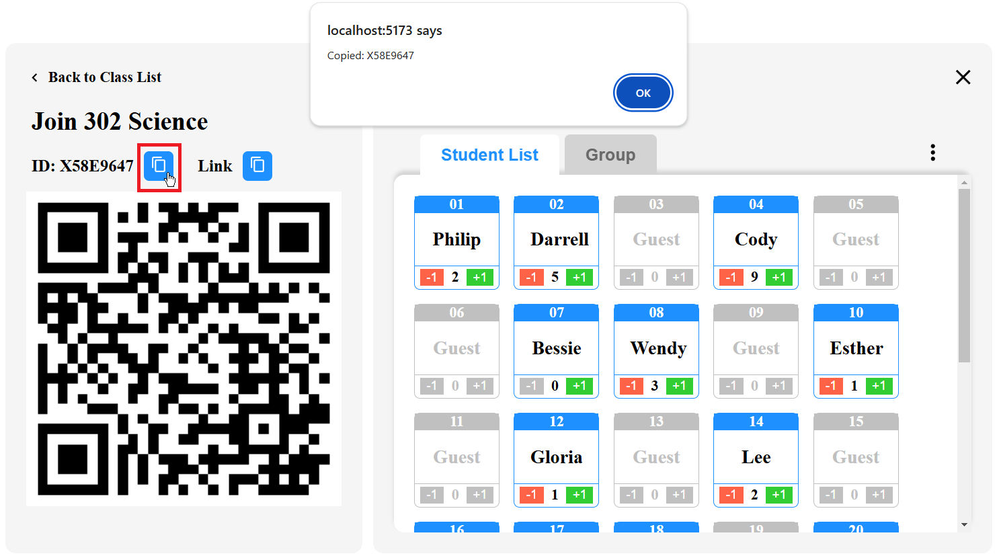

# ViewSonic FE 作業考題 (Nicky Tseng)

## Environment Setup

### `npm install` or `yarn install`

## Run the Web

### `npm run dev` or `yarn dev`

## Vite Default Port (5173)

### http://localhost:5173/

## 前端畫面

### 初始畫面

### 複製功能 (ID)

### 複製功能 (Link)

### Tab 切換 (Student List)

### Tab 切換 (Group) - 五個人為一組

### 按 … 跳出 Menu

### 按 + - 有對應作用

### 按 X 或「Back to Class List」會關閉對應畫面，重整後出現原畫面

### RWD 排版

## API 程式碼位置

[./src/api/mockServer.ts](https://github.com/Fightsea/viewsonicfe/blob/34ae0383b7fd8d9ca393181782200f808db36955/src/api/mockServer.ts)

## API

### GET /api/classes

#### 取得 Class 清單

### GET /api/class/:id/students

#### 取得特定 Class Id 的 Student 清單

